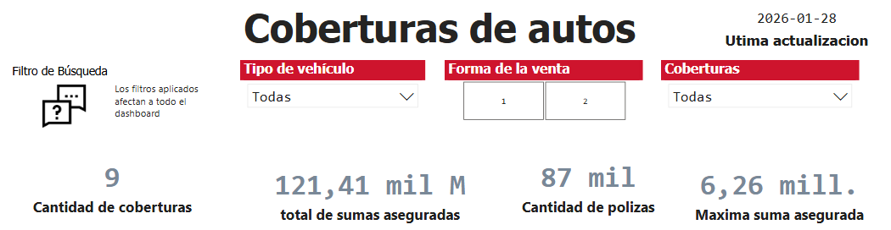
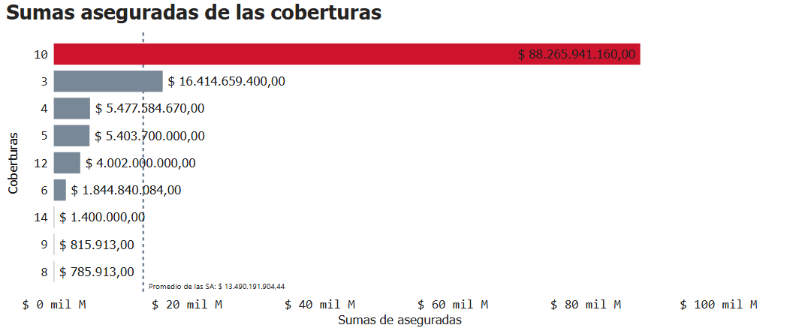
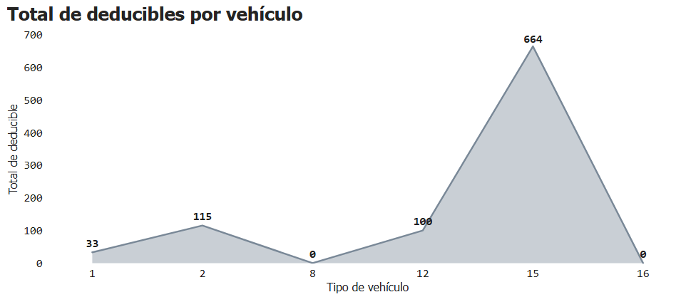
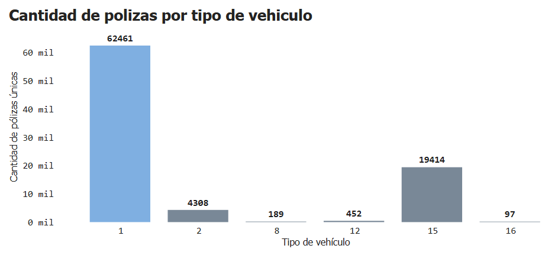

# Business Analyst

## Power BI Dashboard – Insurance Portfolio Analysis

### Descripción
Dashboard interactivo desarrollado en Power BI para el análisis del portafolio de una empresa de seguros. 
Permite visualizar la **cantidad de pólizas** y las **sumas aseguradas**, facilitando la identificación de patrones, tendencias y oportunidades de mejora.

El tablero apoya la toma de decisiones mediante:
- Análisis de distribución de pólizas por categoría
- Evaluación de sumas aseguradas y su concentración
- Detección de insights accionables para optimizar la gestión del negocio

